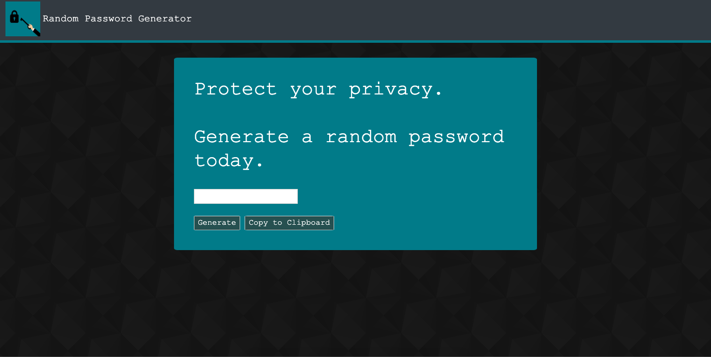

# Password Generator

## Purpose

The purpose of this project is to generate a secure password for users. It accomplishes strength, and thus security, by randomly selecting characters. The user is able to set parameters regarding which characters they want in their password. The user selects the length of the password but is restricted in that it must be a whole number between 8 and 128.

[The finished product.](https://kaitlyncarlson.github.io/PasswordGenerator/ "Password Generator")

## Functionality

In the case that a user is simply viewing the application, and not yet in need of a password, the generating code is not called upon until the "Generate" button is clicked by the user.

When the user clicks the generate button they receive a series of alert messages from the browser that will establish and communicate the parameters of their desired password to the passwordGenerator() function. passwordGenerator() first prompts the user to establish their password length. 

The user input is only accepted if it is a **number** between **8** and **128**. If user input does not match the criteria users are alerted that their input was invalid, and then prompted once again. 

Once the user has entered an acceptable value, they are alerted their entered length. 

Then the user is prompted through a series of alerts establishing their password criteria. There are 4 questions which will either includ or exclude _numeric characters_, _uppercase characters_, _lower case characters_, and _special characters_.

Users must select at least one character in order to generate a password. If no character style is selected they are alerted by the browser. 

Once the desired parameters are established the code then pulls together the relevant potential character options and randomly selects a set of characters that is equivalent in length to the user's entereed password length. The generated password then appears in the password field. 

The generated password can be copied to a user's clipboard by clicking the "Copy to Clipboard" button. When the password is successfully copied to a clipboard the user is notified by the browser. 

